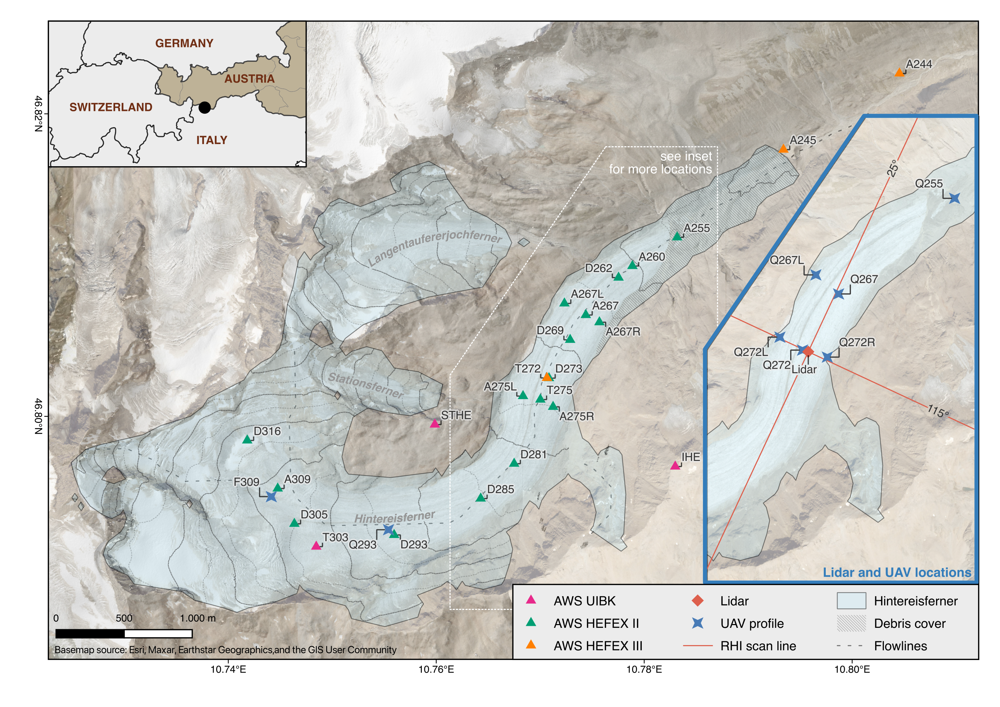

# Validation of high-resolution ICON-LES in complex terrain using observations from two HEFEX field campaigns


This repository contains the data, analysis workflows, and visualization 
scripts supporting the scientific study evaluating high-resolution 
atmospheric simulations performed with the ICOsahedral Nonhydrostatic 
model in Large-Eddy Simulation mode (ICON-LES) over complex glacier terrain. 
The repository is part of the **Glacier Space** Project.

The primary purpose of this repository is to ensure transparency, 
reproducibility, and accessibility of the analysis by providing processed datasets, analysis notebooks, 
statistical evaluation workflows, and figure generation scripts.

## Study Area




## Repository Structure
```
icon_validation/
│
├── data_in/
│
├── data_out/
│   ├── obs/
│   ├── icon/
│   ├── era5/
│   └── misc/
│
├── notebooks/
│
├── figures/
│   ├── pdf/
│   └── png/
│
├── statistics/
│
└── README.md
```

### `data_in/`

This directory contains glacier outlines and location information from 
the HEFEX II and HEFEX III field campaigns.

### `data_out/`

This directory contains processed datasets used for the analysis and 
visualization presented in the manuscript.

The datasets originate from three main sources:

- **Observational data** (`obs/`)\
Processed observational datasets collected during the field campaign, 
including Doppler lidar measurements and meteorological tower observations.
- **ICON simulation data** (`icon/`)\
Output from high-resolution ICON-LES simulations used for model evaluation.
- **ERA5 reanalysis** (`era5/`)\
Atmospheric reanalysis data from ERA5 used for synoptic-scale context and comparison.

The files stored in this directory represent analysis-ready NetCDF datasets 
generated through preprocessing workflows contained in the `notebooks/` directory.

### `notebooks/`

This directory contains Jupyter notebooks used throughout the study workflow. 
The notebooks fall into three main categories:

1. **Data Preparation / Conversion** \
these notebooks preprocess raw input data and convert them into 
standardized formats for subsequent analysis. Raw observational datasets and ICON simulation outputs 
can be requested from the authors.
2. **Figure Generation**  \
these notebooks generate the figures included in the manuscript, 
using processed datasets from `data_out/`. Some files are too large and can be 
downloaded from Zenodo (see associated publication section below) or must be requested from the authors.
3. **Statistical Analysis** \
these notebooks perform statistical evaluations of model performance 
against observations, including error metrics and skill scores.

### `figures/`

This directory contains exported figures generated by the notebooks.

- `png/`: quick visualization 
- `pdf/`: publication-quality vector graphics

The figures correspond directly to those shown in the accompanying manuscript.

### `statistics/`

This directory stores tabular output generated from the statistical 
analysis notebooks.


## Associated Publication

DOI, Abstract, ...


## Citation of Datasets

The following datasets are associated with the study and are available on Zenodo. 
Please cite the relevant DOI when using them in your research.

- **HEFEX II Observations**
  - AWS Data: <a href="https://doi.org/10.5281/zenodo.21130355"></a>
- **HEFEX III Observations**
  - AWS Data: <a href="https://doi.org/10.5281/zenodo.21130441"></a>
  - WindRanger lidar: [](https://doi.org/10.5281/zenodo.19596272)
  - Streamline lidar: [](https://doi.org/10.5281/zenodo.19626880)
  - UAV: [](https://doi.org/10.5281/zenodo.19596612)
- **ICON Experiments**
  - Grid definitions and external parameters for model domains: [](https://doi.org/10.5281/zenodo.19603818)
  - **Note**: HEFEX II and HEFEX III datasets include extracts of simulation outputs used for observation validation.

Also check the [Glacier Space Zenodo Community](https://zenodo.org/communities/glacier_space) for additional 
datasets and publications related to the project and HEFEX campaigns.

## Contact

For questions regarding the repository or associated publication, please contact: 

[Alexander Georgi](mailto:alexander.georgi.1@geo.hu-berlin.de)
[](https://orcid.org/0009-0000-9465-6761)

## License

Code: MIT License  
Data and figures: CC BY 4.0
